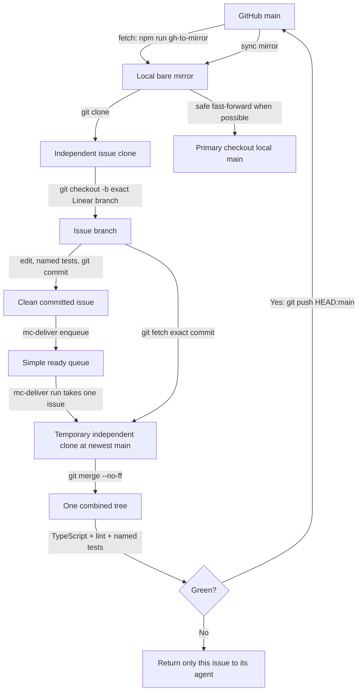

# How Maincar code gets checked and added to `main`

This is the simple workflow for a hobby project with 10–20 coding agents working at the same time on one computer.

## The short version

Each issue gets its own independent folder. Agents can edit at the same time without changing each other's files.

The computer allows at most three complete check jobs at once. A small development test uses one test worker. Every other check uses at most two test workers. The heaviest allowed test load is therefore six test workers total.

When an issue is ready, it waits in a simple line. The delivery command handles one issue, from start to finish, before taking another. It combines that issue with the newest `main`, runs TypeScript, lint, and only the specifically named tests, then sends the exact checked result to GitHub.

We do not require a browser test. We do not run every server, web, or database test. We do not combine several issues into one delivery. We do not automatically retry a failure or run extra tests to isolate it.

## Plain-language definitions

- **GitHub `main`:** the official saved version on GitHub.
- **Local `main`:** the `main` branch in the primary checkout on this computer.
- **Branch:** a named line of saved changes for one issue.
- **Commit:** one saved set of file changes.
- **Clone:** an independent project folder with its own Git information. Maincar issue folders are clones.
- **Git worktree:** another editable folder that shares one repository's Git information. Maincar does not use these for normal issue work.
- **Working tree:** Git's generic name for the visible files inside any editable repository folder. It does not mean the same thing as a Git worktree.
- **Local mirror:** a local copy of GitHub's Git history. It has no editable project files. New issue clones copy history from it quickly.
- **Process:** one running program. An agent, test command, server, database, and editor can each start one or more processes.
- **Check job:** one complete request to `mc-gate`. A job may contain TypeScript, lint, and several specifically named test files.
- **Test worker:** one helper process used by Vitest to run tests. Two workers can run parts of one test request at the same time.
- **Queue:** a saved waiting line of committed issues ready for delivery.
- **Merge:** combine one branch's saved changes with another branch. Delivery uses `git merge --no-ff`, which keeps the issue's existing commits and adds a merge commit.
- **Rebase:** move or rewrite an issue's commits so they appear to start from a newer point. This workflow does not rebase during delivery.
- **Fast-forward:** move a branch pointer forward when there are no competing local commits. Safe primary refresh uses this.
- **TypeScript check:** finds code that uses the wrong kind of value, calls something incorrectly, or otherwise breaks TypeScript's rules. It does not run the app.
- **Lint:** checks code against formatting and code-quality rules. It does not prove the feature works.
- **Server test:** checks server code such as API behavior without using a real browser.
- **Web test:** checks client code such as React behavior in a simulated page environment, not a person clicking Chrome.
- **Integration test:** checks several real parts working together, commonly server code plus the test database.
- **Database schema check:** confirms the database definition and generated Prisma code agree. A real schema change may also need a named database integration test.

## The four folders

| Folder | What it is | Branch | What happens there |
| --- | --- | --- | --- |
| `~/Documents/Coding/My Projects/maincar-2` | Primary checkout: an independent clone used to run the current app | `main` only | Automatically refreshed only when clean, idle, and safe. Never edit or commit issue work here. |
| `~/code/maincar-2-coord/local-main.git` | Bare local mirror: Git history only, with no visible project files | local copy of GitHub `main` | Receives updates from GitHub. New issue clones copy from it. Direct pushes are blocked. |
| `~/code/maincar-2-worktrees/mai-123-name` | One independent issue clone | the exact Linear branch name | One agent edits, tests, and commits one issue here. Despite the parent folder's old name, these are clones, not Git worktrees. |
| a temporary `mc-deliver-*` folder | One throwaway independent clone | starts at `main`; then contains one merge commit | Combines and checks one issue. It is removed afterward. |

## Why use the local mirror?

Without the mirror, 10–20 agents would each ask GitHub for the same project history. With the mirror, `npm run gh-to-mirror` asks GitHub only for new history, and each new issue clone copies the bulk of the repository locally.

The mirror is still synchronized before a new issue clone and before every delivery. That is not wasted duplication:

- The first synchronization makes sure the new issue starts from current GitHub `main`.
- The later synchronization catches changes delivered after the issue started.
- Copying from the local mirror is much faster and lighter than downloading all history separately for every agent.

The mirror stores Git history only. It does not run database migrations or update a database. Updating the primary checkout from the mirror can run `npm ci` for changed package files and `prisma migrate deploy` for tracked Prisma migrations.

## Check limits

At most three complete check jobs may run at once across all clones. This applies to intermediate development checks, commit-time checks, final checks, and delivery checks.

This does not mean only three agents may work. Ten or twenty agents may edit, think, search, and commit. Only their check jobs wait when three are already running.

### Why three jobs?

Tests compete for processor time, memory, database connections, and disk access. Starting every requested check immediately made each check slower and made timing-sensitive tests fail randomly. Three jobs provide useful parallelism while leaving room for agents, the editor, the database, and the operating system.

The tradeoff is simple: a fourth check waits. That check usually finishes sooner than it would if the machine were overloaded by many simultaneous test suites.

### Why one or two workers per job?

A focused single-file test uses one worker. It is already small, so extra workers provide little benefit.

TypeScript, lint, final checks, and delivery checks may use two Vitest workers. Vitest automatically divides runnable tests between them; the agent does not need to start server and client commands in parallel. The job still runs its named commands in a clear order. The workers parallelize work inside a Vitest command.

Three jobs times two workers means at most six Vitest workers. The tradeoff is that one job may take slightly longer than it would with many workers, but the whole computer remains responsive and tests are less likely to fail only because the machine is busy.

Delivery gets the next free check slot. Commit/final checks come next. Focused development tests come after those. Running checks are never interrupted.

## Which checks run?

During development, an agent runs one exact test file:

```bash
./.claude/scripts/coord/mc-gate --focused -- \
  npm --prefix server exec vitest run src/routes/__tests__/companies.test.ts
```

Before delivery, the agent can run TypeScript, lint, and exact relevant files:

```bash
./.claude/scripts/coord/mc-gate --check \
  --test server:src/routes/__tests__/companies.test.ts \
  --test integration:src/routes/__tests__/companies.integration.test.ts
```

Accepted test names are:

- `server:path` for one server Vitest file;
- `vite:path` for one client Vitest file;
- `integration:path` for one database-backed integration file;
- `shell:path` for one coordination script test.

The test names are saved in local queue data when the issue is enqueued. They are not merely left in chat and are not added as a commit comment.

`npm test` is a package command whose exact meaning depends on the package. It does not mean “all required checks everywhere.” This workflow calls the exact commands it needs. It does not use `npm test` or `npm run verify` for delivery.

## Why not run everything?

The repository has many tests because it has many behaviors: server routes, client interactions, permissions, scheduling, database rules, and old bug protections. The total grew as features and bug fixes accumulated.

Whole suites take a long time because they start many test files, prepare test environments, compile code, and sometimes create databases. Under heavy machine load, timing-sensitive tests can wait longer than expected and fail even when the product code is correct.

For a hobby project, running every test for every small change costs more time than the extra confidence is worth. The new rule is to run TypeScript, lint, and the exact tests that cover the changed behavior. A database change gets an exact database test when needed. The full suite is ignored for now.

## Why the old shared delivery scheduler was flaky

The old scheduler could start several large test jobs. Each job could itself create several test workers. Agents and local servers were also using the same processor, memory, disk, and database.

The shared delivery scheduler test depended on jobs starting within a short amount of time. On a busy computer, a process could be ready but not receive processor time before the test's deadline. The feature was working, but the test mistook “started late” for “did not start.”

The immediate code fixes were to run client tests from the client folder, correct a test fixture's path handling, and wait for scheduler jobs based on an observable start rather than a fragile short delay. The larger fix is this simpler, lower-concurrency workflow.

## Every delivery step



| Step | Folder and kind | Branch | Command or Git term | Usual time and why |
| --- | --- | --- | --- | --- |
| 1. Synchronize history | Run from any clone; updates the bare mirror | GitHub `main` copied to mirror `main` | `npm run gh-to-mirror` (`git fetch`) | Often 1–10 seconds. It downloads only new Git objects. Network speed matters. |
| 2. Create issue folder | New independent issue clone | starts at `main` | `git clone ~/code/maincar-2-coord/local-main.git mai-123-name` | Often 1–5 seconds because history is copied locally. |
| 3. Create issue branch | Issue clone | exact Linear branch name | `git checkout -b <Linear gitBranchName>` | Usually under 1 second. It creates a branch name; it does not copy files again. |
| 4. Develop | Issue clone | issue branch | edit files; `mc-gate --focused`; `git commit` | Depends on the work. One focused server/client test is commonly several seconds to about 30 seconds. |
| 5. Commit checks | Issue clone | issue branch | pre-commit calls `mc-gate --static` | Commonly 15–60 seconds. TypeScript and lint inspect many source files, but do not run product behavior. It may wait if three jobs already run. |
| 6. Record readiness | Issue clone | issue branch | `mc-deliver enqueue --test kind:path` | Usually a few seconds. It synchronizes the mirror and saves a small local queue entry. |
| 7. Build candidate | Temporary independent clone | newest `main`, then a merge commit | `git fetch` exact issue commit; `git merge --no-ff` | Usually a few seconds. A conflict stops this issue and sends it back to its agent. |
| 8. Check candidate | Temporary clone | merge commit | TypeScript, lint, named Vitest/integration files | Often tens of seconds to a few minutes. Time depends on the named tests; a database test is slower because it prepares and uses a database. |
| 9. Publish | Temporary clone | checked merge commit becomes GitHub `main` | confirm base unchanged; `git push HEAD:main` | Often 1–10 seconds. If GitHub `main` changed, no stale result is pushed. |
| 10. Refresh local copies | Mirror, then primary checkout | `main` | fetch; safe fast-forward; possibly `npm ci` and `prisma migrate deploy` | A few seconds when only Git changes. Package installation or database migrations can take longer. |
| 11. Clean up | Issue clone | detach at delivered `origin/main`, then remove local branch/folder | verify commit is on GitHub `main`; delete clean clone | Usually seconds. Dirty or undelivered work is never deleted. |

Times are estimates, not deadlines. The named tests and current machine load are the biggest variables.

## What happens to local `main`?

GitHub `main` and the mirror are always updated as part of a successful delivery. The primary checkout's local `main` is also updated automatically when it is safe.

Automatic refresh stops without changing anything if the primary checkout:

- has uncommitted or untracked files;
- is not on `main`;
- has a local commit that GitHub does not have; or
- is currently running a Maincar process.

This prevents an automatic operation from moving files underneath a person or running app. The command records the reason and prints:

```bash
npm run mirror-to-main
```

Manual refresh uses the same safety rules. It is not inherently safer than automatic refresh. The practical difference is that a person runs it after resolving the reason for the block—for example, after committing personal files or stopping the app. Neither automatic nor manual refresh overwrites uncommitted files.

The primary checkout can temporarily remain behind GitHub without harming issue clones or delivery because those use the synchronized mirror. It becomes a problem only if someone expects the primary checkout to run the newest code; `npm run mirror-to-main` resolves that after it is safe.

## What “hobby mode” means here

“Hobby mode” is not a separate switch. It is the workflow described in this document and enforced by the scripts and rules:

- independent clone per issue;
- at most three check jobs and six Vitest workers;
- one issue per delivery;
- specifically named tests instead of whole suites;
- no required browser journey;
- no risk labels or compatible-group calculations;
- no automatic failure isolation or retry tree;
- no detailed train receipts;
- safe mirror and primary-checkout refresh;
- simple proof that the delivered commit reached GitHub before cleanup.

This keeps the safeguards that prevent lost work or unchecked pushes, while removing machinery designed for a much larger production operation.
